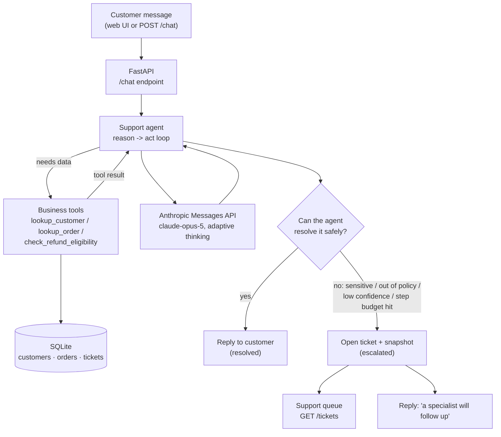
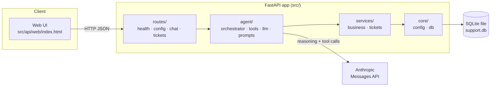

# AI Customer Support Platform

An AI support agent you can run on your own machine. It reads a customer message,
looks up real order and account data with tools, resolves what it can safely
handle, and opens a human ticket for everything else — with a web UI that shows
you every step it took.

> **Local demo — no cloud, no deploy:**
> ```
> http://localhost:8000
> ```

<p align="center">
  
  
  
  
  
</p>

---

## What Is This?

A small, honest customer-support agent. You send it a message like *"Where is my
order ORD-1002?"* or *"Refund ORD-1001, I changed my mind."* It:

1. **reasons** about what it needs,
2. **calls real tools** against a local database (customer lookup, order lookup,
   refund-policy check),
3. **answers** the customer when it is confident and allowed to, or
4. **escalates to a human** — opening a ticket with a transcript snapshot —
   when the case is sensitive, out of policy, or beyond its confidence.

The web UI at `http://localhost:8000` lets you try this interactively and shows
the pipeline the agent went through, the tools it called, how many reasoning
steps it took, and whether it resolved or escalated.

Everything runs locally: a FastAPI server, a file-based SQLite database seeded
with demo data, and calls to the Anthropic Messages API for the reasoning.

## The Problem

Support teams answer the same narrow questions over and over — order status,
refund eligibility, account issues — and each one still means a person opening a
CRM tab, checking a policy, and typing a reply. A plain chatbot doesn't help:
it has no access to the order record and no safe way to say *"this one needs a
human."*

## The Solution

Give the model **tools** instead of just a prompt, and put **hard limits**
around what it's allowed to do on its own:

- It can *check* refund eligibility; it can never *issue* a refund — that tool is
  always intercepted and turned into a human ticket.
- It can escalate itself at any point (angry customer, account security, low
  confidence).
- If it loops without finishing, a step budget forces a handoff.

The result is an agent that handles the easy, well-defined cases end to end and
routes the rest to people, with a paper trail for every decision.

## What Can It Do?

Implemented and working today:

- **Agentic reason → act loop** over the Anthropic Messages API, capped at
  `MAX_AGENT_STEPS` (default 6) iterations.
- **Three read-only business tools**, backed by SQLite:
  `lookup_customer`, `lookup_order`, `check_refund_eligibility`.
- **Refund-policy engine** — auto-eligible only if the order was delivered,
  within a 30-day window, under \$200, and not already refunded.
- **Human-in-the-loop escalation** with three deterministic backstops:
  1. the model calls `escalate_to_human`,
  2. the model calls the sensitive `issue_refund` tool — intercepted, never
     executed by the AI,
  3. the loop exceeds its step budget.
- **Ticketing** — every escalation opens a ticket with a conversation snapshot;
  full CRUD API and a live queue in the UI.
- **Web UI** at `/` — chat, a pipeline view, a per-request analysis panel, and
  the support queue. Single file, no build step.
- **Graceful no-key mode** — without an API key the server still runs; the UI,
  queue, and ticket APIs work, and `POST /chat` returns a clear `503`.
- **29 tests**, no network (the LLM is a scripted stand-in).

## How It Works



The loop itself, each turn:

1. Send the conversation + tool schemas to the model.
2. If the model returns a normal answer → **resolved**, return the reply.
3. If it calls a read-only tool → run it, feed the result back, loop.
4. If it calls `escalate_to_human` or `issue_refund` → **escalated**, open a
   ticket, stop.
5. If step `MAX_AGENT_STEPS` is reached without an answer → **escalated**.

## Try the Demo

Start the server (see [Quick Start](#quick-start)), open
`http://localhost:8000`, and either click an example — it fills the input box,
then you press **Analyze request** — or type your own.

Demo identities: customers `ada@example.com`, `grace@example.com`,
`alan@example.com`; orders `ORD-1001` … `ORD-1005`.

| Try this | What you should see |
| --- | --- |
| `Where is my order ORD-1002?` | Agent calls `lookup_order`, reports it shipped, **resolved**. |
| `I'd like a refund on ORD-1001, I changed my mind.` | Agent checks eligibility (delivered, in window, under \$200) → within policy; a refund still can't be issued by the AI, so it **escalates** with a ticket. |
| `Refund ORD-1003 please, it's been ages.` | Eligibility check fails (outside the 30-day window) → **escalated** for a specialist. |
| `Someone changed my password and I can't log in!` | Account-security case → agent calls `escalate_to_human`, ticket opens, **escalated**. |
| `This is unacceptable. I want to escalate to your legal team.` | Complaint path → **escalated** immediately. |

Each response also updates the **Last request analysis** panel (tools called,
reasoning steps, resolution status) and, on escalation, adds a row to the
**Support queue** that you can mark resolved.

## Explore Without an API Key

You can run and inspect most of the app before setting any key. The chat agent
is the only part that needs one — it calls the Anthropic Messages API to do the
reasoning, and there is no OpenAI or other-provider fallback in the code.

Start the server (`.\start.ps1` / `make run`) with an empty `ANTHROPIC_API_KEY`
and open `http://localhost:8000`.

**Works without a key:**

| What | How to check |
| --- | --- |
| Web UI loads, fully styled | Open `http://localhost:8000` — you'll see a "No API key set" banner; the model pill reads `… · inactive` |
| Support queue | Create a ticket (below), then watch it appear in the right-hand queue and mark it resolved |
| Ticket API | `GET/POST /tickets`, `GET/PATCH /tickets/{id}` |
| Health & config | `GET /health`, `GET /config` (returns `"llm_configured": false`) |
| Swagger / OpenAPI | `http://localhost:8000/docs`, `/openapi.json` |
| Full test suite | `pytest` → `29 passed` (tests use a scripted stand-in LLM, no network) |

```bash
# create a ticket, then list it (PowerShell: use curl.exe)
curl -s -X POST http://localhost:8000/tickets \
  -H "Content-Type: application/json" \
  -d '{"subject":"Damaged item","body":"Box arrived crushed","reason":"manual","customer_email":"ada@example.com"}'
curl -s http://localhost:8000/tickets
curl -s -X PATCH http://localhost:8000/tickets/1 \
  -H "Content-Type: application/json" -d '{"status":"resolved"}'
```

**Needs a key:** typing a message and pressing **Analyze request**. Without a key
it returns a clear `503` in the chat box (no crash), and the pipeline / analysis
panel stay empty because there is no agent run to show. To see the agent reason,
call tools, and resolve or escalate — the core of the demo — add your key to
`.env` and restart.

## Screenshots

_Not committed yet._ To capture your own: start the server, open
`http://localhost:8000`, run a couple of the examples above, and screenshot the
chat with the pipeline and analysis panel. Drop images in `docs/` and link them
here.

## Architecture



Design choices:

- **Modular packages** — `api`, `agent`, `services`, `core`, `models`, `data`.
- **Pluggable LLM seam** — the agent depends on a tiny `LLMClient` protocol, so
  the loop is unit-tested with a scripted client and zero network calls.
- **Tools are plain functions over a SQLite connection** — easy to test, easy to
  swap for a real CRM later.
- **Escalation is deterministic** — the model can *ask* to hand off, but three
  code-level backstops guarantee it, regardless of what the model does.

## AI Workflow

| Component | File | Role |
| --- | --- | --- |
| System prompt | `src/agent/prompts.py` | Ground answers in tool output; when to escalate. |
| Loop | `src/agent/orchestrator.py` | Reason → act iterations + the three escalation backstops. |
| Tool schemas + dispatch | `src/agent/tools.py` | What the model may call; runs the read-only ones. |
| LLM client | `src/agent/llm.py` | `AnthropicLLM` (real) and `ScriptedLLM` (tests / offline). |
| Model | `claude-opus-5` (configurable) | Adaptive thinking; chosen per request by the agent. |

The response the UI renders (`ChatResponse`) contains only real data: the reply,
`resolved` / `escalated` flags, `ticket_id`, `steps`, and the list of
`tool_calls` with their inputs and outcomes. There is no hidden chain-of-thought
in the payload.

## Tech Stack

| Technology | Role |
| --- | --- |
| Python 3.11+ | Language |
| FastAPI + Uvicorn | HTTP API and server |
| Pydantic / pydantic-settings | Request/response models, configuration |
| Anthropic Python SDK | Messages API — agent reasoning and tool calling |
| SQLite (stdlib `sqlite3`) | Customers, orders, tickets |
| Pytest | Test suite (29 tests, no network) |
| GitHub Actions | CI on Python 3.11 / 3.12 / 3.13 |

## Project Structure

```text
ai-customer-support-platform/
├── src/
│   ├── app/__main__.py        # `python -m app` launcher (host/port/reload)
│   ├── api/
│   │   ├── main.py            # FastAPI app, lifespan (init DB + seed), UI route, error handler
│   │   ├── deps.py            # settings / DB / LLM / conversation-store providers
│   │   ├── routes/            # health, config, chat, tickets
│   │   └── web/index.html     # single-file demo UI (served at /)
│   ├── agent/
│   │   ├── orchestrator.py    # reason -> act loop + escalation backstops
│   │   ├── tools.py           # tool schemas + dispatcher
│   │   ├── llm.py             # LLMClient protocol, Anthropic + scripted clients
│   │   └── prompts.py         # support system prompt
│   ├── services/
│   │   ├── business.py        # lookup_customer / lookup_order / refund policy
│   │   └── tickets.py         # ticket persistence
│   ├── core/
│   │   ├── config.py          # pydantic-settings
│   │   └── db.py              # SQLite connection + schema
│   ├── models/schemas.py      # API request/response models
│   └── data/seed.py           # demo customers + orders
├── tests/                     # 29 tests, no network (scripted LLM)
├── start.ps1 / start.bat      # one-command start (Windows)
├── Makefile                   # setup / run / dev / test (Linux/macOS)
├── .env.example
└── pyproject.toml
```

## Quick Start

### Prerequisites

**Required**

- **Python 3.11 or newer** — <https://www.python.org/downloads/>
- **Git**

**Required only for the AI chat**

- An **Anthropic API key** — <https://console.anthropic.com/>. Without it the
  server still runs and the UI, support queue, and ticket APIs all work;
  `POST /chat` returns `503` until the key is set.

Not needed: no PostgreSQL, no Docker, no Ollama, no local model, no Node.

### 1. Clone

```bash
git clone https://github.com/zeeshanqadir568/ai-customer-support-platform.git
cd ai-customer-support-platform
```

### 2. Start

**Windows (PowerShell):**

```powershell
.\start.ps1
```

If PowerShell blocks the script:
`powershell -ExecutionPolicy Bypass -File .\start.ps1`

**Linux / macOS:**

```bash
make run
```

**Any platform, manually:**

```bash
python -m venv .venv
# Windows:        .venv\Scripts\activate
# Linux / macOS:  source .venv/bin/activate
pip install -e ".[dev]"
cp .env.example .env        # Windows: copy .env.example .env
python -m app
```

The start scripts create the virtual environment, install dependencies, and
create `.env` from `.env.example` on first run.

### 3. Add your API key (to enable chat)

Open `.env` and set:

```env
ANTHROPIC_API_KEY=sk-ant-...
```

Then restart the server. Skip this step to explore everything except the chat.

### 4. Open

| URL | What it is |
| --- | --- |
| <http://localhost:8000/> | **Web UI** — chat, pipeline view, analysis panel, support queue |
| <http://localhost:8000/docs> | Interactive Swagger / OpenAPI docs |
| <http://localhost:8000/health> | Liveness check |

Use a different port with `.\start.ps1 -Port 8080`, `PORT=8080 make run`, or
`PORT=8080 python -m app`.

## Configuration

All settings are read from `.env` (see `.env.example`).

| Variable | Required | Default | Purpose |
| --- | --- | --- | --- |
| `ANTHROPIC_API_KEY` | for chat only | _(empty)_ | Enables `POST /chat`. Empty ⇒ chat returns `503`, rest works. |
| `MODEL` | no | `claude-opus-5` | Model the agent uses. `claude-sonnet-5` / `claude-haiku-4-5` are cheaper. |
| `MAX_AGENT_STEPS` | no | `6` | Reason→act iterations before auto-escalation. |
| `DATABASE_PATH` | no | `support.db` | SQLite file (git-ignored). |
| `SEED_ON_STARTUP` | no | `true` | Seed demo customers/orders on start (idempotent). |
| `HOST` / `PORT` / `RELOAD` | no | `127.0.0.1` / `8000` / off | Read by `python -m app`. |

## API

Base URL: `http://localhost:8000`

| Method | Path | Purpose |
| --- | --- | --- |
| `GET` | `/` | Web UI |
| `GET` | `/health` | Liveness check |
| `GET` | `/config` | Non-secret settings the UI needs (`llm_configured`, `model`, `max_agent_steps`) |
| `POST` | `/chat` | Run the support agent on one customer message |
| `GET` | `/tickets` | List tickets (optional `?status=open\|in_progress\|resolved`) |
| `POST` | `/tickets` | Open a ticket manually |
| `GET` | `/tickets/{id}` | Fetch one ticket |
| `PATCH` | `/tickets/{id}` | Update ticket status |
| `GET` | `/docs`, `/openapi.json` | Swagger UI and OpenAPI schema |

**`POST /chat` request:**

```json
{ "message": "Where is my order ORD-1002?", "customer_email": "ada@example.com" }
```

**Response:**

```json
{
  "conversation_id": "9f2c...",
  "reply": "Your USB-C hub (ORD-1002) shipped 3 days ago and is on its way.",
  "resolved": true,
  "escalated": false,
  "ticket_id": null,
  "steps": 2,
  "tool_calls": [
    { "step": 1, "name": "lookup_order", "input": { "order_id": "ORD-1002" }, "outcome": "{\"found\": true, ...}" }
  ]
}
```

**Error behaviour:** empty/whitespace message ⇒ `422`; no API key ⇒ `503` with a
clear message; model/network failure ⇒ `502` with a friendly message (never a
stack trace). The UI renders all of these inline.

## Testing

```bash
pytest            # or: make test   /   .venv\Scripts\python -m pytest
```

29 tests, no network. The agent loop is exercised with a scripted LLM client, so
tests run without an API key. Coverage: business tools + refund policy, ticket
service, the agent loop and all three escalation backstops, and the HTTP API
(including the `422` / `503` / `502` error paths).

## Roadmap

**Implemented**

- [x] FastAPI app, modular layout, OpenAPI docs
- [x] Configuration via `pydantic-settings`
- [x] SQLite database + seeded demo data
- [x] Ticket management (models + CRUD API + live queue)
- [x] Anthropic Messages API integration (pluggable client)
- [x] Agentic reason→act loop
- [x] Read-only business tools (customer / order / refund)
- [x] Human escalation (model-driven + 3 deterministic backstops)
- [x] Web UI — chat, pipeline view, analysis panel, support queue
- [x] Graceful degradation without an API key
- [x] One-command local start (Windows scripts + Makefile)

**Planned**

- [ ] Conversation persistence (currently in-process only)
- [ ] Knowledge base / RAG retrieval as an agent tool
- [ ] Authentication & authorization
- [ ] Postgres option alongside SQLite
- [ ] Docker / docker-compose
- [ ] Observability (structured logs, tracing, metrics)
- [ ] Deployment guide

## Contributing

Issues and pull requests are welcome. For anything larger than a small fix,
please open an issue first to discuss the approach. Run `pytest` before
submitting.

## License

No license file yet — all rights reserved by the author for now. A license will
be added before any public deployment.

## Author

**Zeeshan Qadir** — AI / backend engineering: agents, retrieval-augmented
generation, LLM applications, automation.
